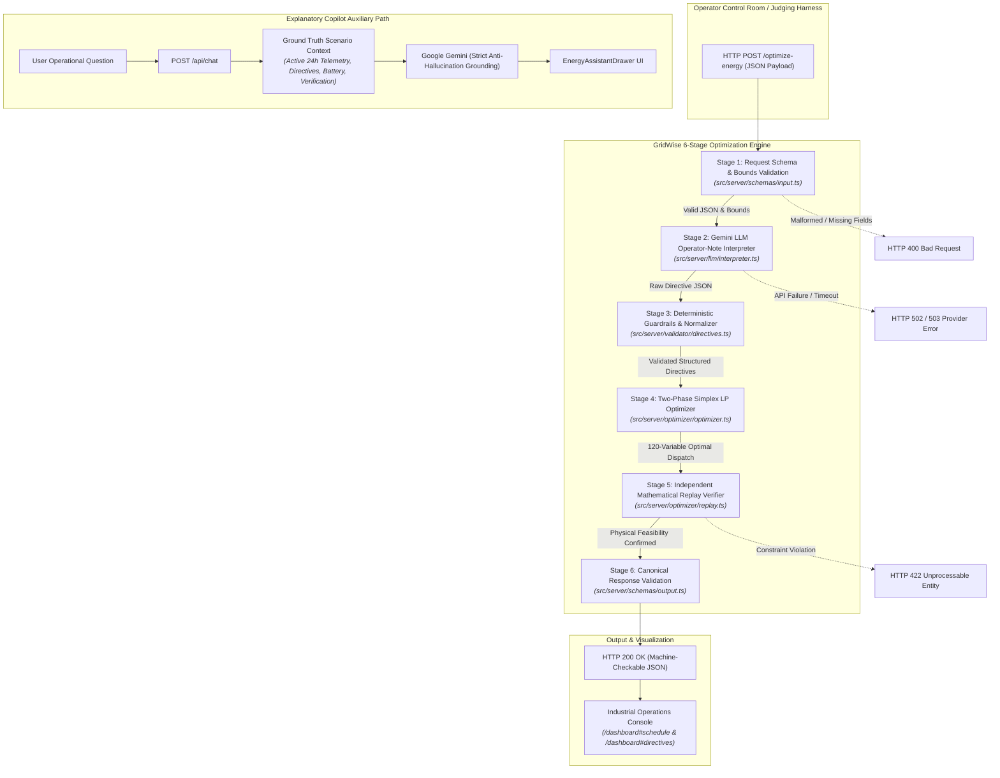

# GridWise — Smart Campus Energy Optimization Platform

> **BUP CSE Fest 2026 — Hackathon Preliminary Round**  
> *Smart Campus Energy Optimization Challenge: LLM-Assisted Operator Directive Interpretation*  
> Developed by **Team GridWise** for Bangladesh University of Professionals (BUP) in association with Poridhi.io.

---

[](https://nextjs.org/)
[](https://www.typescriptlang.org/)
[](https://tailwindcss.com/)
[](#07-optimization-objective--mathematical-formulation)
[](https://ai.google.dev/)
[](#19-production-multi-stage-docker-container)
[](#18-automated-testing--verification-suites)

---

## Table of Contents

- [01. The Scenario & Problem Background](#01-the-scenario--problem-background)
- [02. What We Are Building](#02-what-we-are-building)
- [03. End-to-End System Architecture](#03-end-to-end-system-architecture)
- [04. Operator Directives & Deterministic Effects](#04-operator-directives--deterministic-effects)
- [05. LLM Interpretation Requirements](#05-llm-interpretation-requirements)
- [06. Deterministic Guardrails & Normalization](#06-deterministic-guardrails--normalization)
- [07. Optimization Objective & Mathematical Formulation](#07-optimization-objective--mathematical-formulation)
- [08. Battery Storage & Energy Accounting Rules](#08-battery-storage--energy-accounting-rules)
- [09. API Specification & HTTP Contract](#09-api-specification--http-contract)
- [10. Hidden Evaluation & Consistency Checks](#10-hidden-evaluation--consistency-checks)
- [11. Public Sample Benchmark Cases vs Hidden Evaluation](#11-public-sample-benchmark-cases-vs-hidden-evaluation)
- [12. Performance & Reliability Standards](#12-performance--reliability-standards)
- [13. Explanatory AI Copilot (Grounded Analytical Observer)](#13-explanatory-ai-copilot-grounded-analytical-observer)
- [14. Operations Console & Dual-Role Perspectives](#14-operations-console--dual-role-perspectives)
- [15. Technology Stack](#15-technology-stack)
- [16. Dataset & Data Sources](#16-dataset--data-sources)
- [17. Local Quickstart & Setup Guide](#17-local-quickstart--setup-guide)
- [18. Environment Variables Configuration](#18-environment-variables-configuration)
- [19. Automated Testing & Verification Suites](#19-automated-testing--verification-suites)
- [20. Production Multi-Stage Docker Container](#20-production-multi-stage-docker-container)
- [21. 3-Minute Presentation Walkthrough](#21-3-minute-presentation-walkthrough)
- [22. Submission & Evaluation Deliverables Checklist](#22-submission--evaluation-deliverables-checklist)
- [23. AI-Assisted Development & Hackathon Policy Adherence](#23-ai-assisted-development--hackathon-policy-adherence)
- [24. Security, Credentials & Safe Failure Architecture](#24-security-credentials--safe-failure-architecture)
- [25. Known System Limitations](#25-known-system-limitations)
- [26. Team GridWise](#26-team-gridwise)
- [27. Official Requirement Coverage Matrix](#27-official-requirement-coverage-matrix)

---

## 01. The Scenario & Problem Background

Bangladesh University of Professionals (BUP) operates a modern smart campus microgrid that purchases electricity from the national grid, harnesses on-campus rooftop photovoltaic (PV) solar generation, and leverages an on-site Battery Energy Storage System (BESS). 

Throughout any given 24-hour cycle:
- **Campus Electricity Demand** fluctuates according to academic schedules, administrative sessions, laboratory experiments, and hostel consumption.
- **Rooftop Solar Availability** follows natural diurnal solar irradiance but is susceptible to cloud cover, seasonal factors, and scheduled panel cleaning.
- **Grid Tariffs** vary dynamically across the day (peak, off-peak, and intermediate billing bands).
- **Temporary Operating Conditions** occur frequently. Campus operators document real-time field instructions as short, free-form natural language notes (e.g. equipment maintenance, transformer limits, or emergency safety protocols).

For every scenario, the service is supplied with the complete 24-hour input vector ($h \in \{0, 1, \dots, 23\}$) for campus load, solar potential, and grid tariffs, along with 1 to 3 operator shift notes. The system must synthesize these inputs, correctly interpret natural language operational constraints, enforce rigorous physical guardrails, and solve for a cost-minimal, physically balanced 24-hour dispatch plan.

---

## 02. What We Are Building

GridWise is built as a single, unified HTTP API and operations service. It receives:
1. **A 24-hour energy scenario** (hourly demand, solar availability, and grid tariffs).
2. **Battery parameters** (capacity, initial energy, minimum reserve, and hourly charge/discharge rate limits).
3. **1 to 3 operator notes** expressing natural-language instructions or operational constraints.

The service performs the following core pipeline operations:
1. **LLM Interpretation**: Parses every operator note using Google Gemini via a structured, few-shot prompt.
2. **Directive Extraction**: Classifies relevant notes into one of the 5 official operational directive types, or marks irrelevant chatter as `no_op`.
3. **Deterministic Guardrails**: Validates and normalizes extracted parameters (clamps solar reduction factors, enforces hour bounds $0..23$, clamps battery reserves to physical capacity, and sorts entries strictly by `note_index`).
4. **Constraint Application**: Injects validated operational bounds directly into the mathematical model.
5. **Two-Phase Simplex LP Solving**: Solves a continuous 120-variable linear program minimizing total grid import cost.
6. **Independent Replay Verification**: Numerically verifies hourly energy balance ($\pm 0.015\text{ kWh}$), battery state transitions, and end-of-day battery neutrality ($E_{23} = E_0$) before returning the schedule.
7. **Canonical Response Emission**: Returns a machine-checkable JSON response adhering strictly to the official competition schema.

> **CRITICAL LLM REQUIREMENT (PDF Section 02):**  
> Google Gemini is strictly embedded within the **operator-note interpretation pipeline**. The LLM directly parses free-form text into structured numerical constraints used by the optimizer. It is **not** used merely for cosmetic documentation, plan summaries, or post-hoc text generation.

---

## 03. End-to-End System Architecture



---

## 04. Operator Directives & Deterministic Effects

The competition specification recognizes exactly **six official directive types**. The table below outlines each directive, its structured adjustment parameters, and its exact deterministic effect on the linear programming optimizer:

| Directive Type | Meaning | Required `structured_adjustment` Shape | Deterministic Optimizer Effect |
| :--- | :--- | :--- | :--- |
| **`solar_reduction`** | Rooftop solar output is curtailed during specified hours (e.g. maintenance, dust, washing). | `{"hours": [int, ...], "factor": number}` | Curtains effective solar:  <br/>$s_h^{\text{eff}} = s_h \cdot \text{factor}$ for each listed hour. |
| **`minimum_battery_reserve`** | Battery energy storage must remain at or above an elevated reserve level. | `{"hours": [int, ...], "minimum_energy_kwh": number}` | Dynamically raises lower energy bound: <br/>$E_h \ge \max(E_{\text{base\_min}}, R_{\text{directive}})$ for listed hours. |
| **`no_charge_window`** | Grid/solar battery charging is strictly disallowed during specified hours. | `{"hours": [int, ...]}` | Fixes charging variable to zero: <br/>$c_h = 0$ for all listed hours. |
| **`no_discharge_window`** | Battery discharging to campus load is strictly disallowed during specified hours. | `{"hours": [int, ...]}` | Fixes discharging variable to zero: <br/>$d_h = 0$ for all listed hours. |
| **`max_grid_window`** | Campus grid import is capped at a fixed ceiling during specified hours. | `{"hours": [int, ...], "max_grid_kwh": number}` | Imposes upper bound on grid variable: <br/>$g_h \le C_{\text{max\_grid}}$ for listed hours. |
| **`no_op`** | Shift note is a conversational distractor and does not affect the 24-hour energy balance. | `null` | **No change** to the mathematical optimization model. |

### Factor Definition & Normalization
- For `solar_reduction`, **`factor`** strictly represents the **usable fraction remaining**.
- *Official Example (Problem Statement Section 04):* An **80% solar reduction** leaves 20% usable generation $\implies \text{factor} = 0.2$.
- Time windows are whole-hour, half-open intervals $[t_{\text{start}}, t_{\text{end}})$. For example, *“1 PM to 3 PM”* corresponds to hours `[13, 14]`.

---

## 05. LLM Interpretation Requirements

The LLM natural language interpretation stage adheres to the following rules:
1. **Full Coverage**: Exactly one `directive_interpretation` entry is produced for every input note.
2. **Preserved Index Ordering**: Directives are returned in exact zero-based `note_index` sequence ($0, 1, \dots, N-1$).
3. **Applies Semantics**:
   - `applies: false` is used **exclusively** for `no_op`.
   - `applies: true` is required for all five active operational directives.
4. **Hour Array Constraints**:
   - Every `hours` array must contain unique integers from $0$ through $23$.
   - Hours must be sorted in strictly ascending numerical order (e.g. `[13, 14, 15]`).
5. **No Parameter Invention**: The LLM is forbidden from fabricating base demand, solar potential, tariff schedules, or battery parameters.
6. **Paraphrase Robustness**: The prompt handles diverse linguistic variations (e.g. *“drop to 20%”*, *“reduced by four-fifths”*, *“one-fifth remaining”* all map to `solar_reduction` with $\text{factor} = 0.2$).

---

## 06. Deterministic Guardrails & Normalization

All raw outputs from Google Gemini are treated as untrusted structured data and subjected to deterministic post-processing in [src/server/validator/directives.ts](file:///i:/BUP_PRELI/src/server/validator/directives.ts):

- **Directive Type Validation**: Only the 6 supported strings are accepted. Any unrecognized or hallucinated type safely falls back to `no_op`.
- **Hour Array Normalization**: Values are validated to be integers in $[0, 23]$, deduplicated, and sorted in ascending order. If an active directive has an empty or invalid hours array, it is rejected to `no_op` to protect solver stability.
- **Solar Factor Clamping**: Clamped strictly to the valid physical closed interval $[0.0, 1.0]$.
- **Battery Reserve Clamping**: Clamped between $0.0$ and the physical battery capacity $C_{\text{battery}}$.
- **Grid Cap Bounds**: Clamped to non-negative real numbers ($C_{\text{max}} \ge 0.0$).
- **Controlled Safe Failure**: If Gemini fails, times out (>25s), or encounters a network partition, the service raises a controlled `LlmProviderError` (HTTP 502/503) without leaking internal credentials, prompts, or stack traces.

---

## 07. Optimization Objective & Mathematical Formulation

The optimizer solves a continuous Linear Program over a 24-hour horizon ($h \in \{0, 1, \dots, 23\}$) with **120 decision variables** (5 per hour: grid draw $g_h$, solar utilized $s_h$, battery charge $c_h$, battery discharge $d_h$, and ending battery state-of-charge $E_h$):

$$\min \sum_{h=0}^{23} \Big( g_h \cdot \text{tariff}_h + \epsilon \cdot (c_h + d_h) \Big)$$

*(where $\epsilon = 10^{-6}$ is a negligible tie-breaking penalty that prevents simultaneous charging and discharging within the same hour).*

### Governing Constraints

1. **Hourly Campus Power Balance (Conservation of Energy):**
   $$g_h + s_h + d_h = \text{demand}_h + c_h \quad \forall h \in \{0, \dots, 23\}$$
2. **Solar Availability & Curtailment Limits:**
   $$0 \le s_h \le s_h^{\text{eff}} = s_h^{\text{raw}} \cdot (1 - \text{curtailment}_h) \quad \forall h \in \{0, \dots, 23\}$$
3. **Battery Energy State Transitions:**
   $$E_0 = E_{\text{initial}} + c_0 - d_0$$
   $$E_h = E_{h-1} + c_h - d_h \quad \forall h \in \{1, \dots, 23\}$$
4. **Physical Battery Bounds & Directive Reserves:**
   $$E_h \ge \max(E_{\text{min}}, R_h^{\text{directive}}) \quad \forall h \in \{0, \dots, 23\}$$
   $$E_h \le C_{\text{capacity}} \quad \forall h \in \{0, \dots, 23\}$$
5. **Operational Charge and Discharge Rate Limits:**
   $$0 \le c_h \le C_{\text{max\_charge}} \quad \forall h \in \{0, \dots, 23\}$$
   $$0 \le d_h \le C_{\text{max\_discharge}} \quad \forall h \in \{0, \dots, 23\}$$
6. **Grid Import Ceilings:**
   $$0 \le g_h \le G_h^{\text{max\_cap}} \quad \forall h \in \{0, \dots, 23\}$$
7. **End-of-Day Neutrality (Non-Negotiable Requirement):**
   $$E_{23} = E_{\text{initial}}$$

> **CORRECTNESS BEFORE COST PRINCIPLE:**  
> Constraint satisfaction and physical feasibility strictly supersede cost minimization. A schedule with an artificially low total cost is treated as entirely invalid if it violates power balance, battery limits, or any applicable operator directive.

---

## 08. Battery Storage & Energy Accounting Rules

- **Discrete Hourly Actions**:
  - `charge`: $E_{\text{after}} = E_{\text{before}} + \text{battery\_kwh}$ ($c_h > 0, d_h = 0$).
  - `discharge`: $E_{\text{after}} = E_{\text{before}} - \text{battery\_kwh}$ ($c_h = 0, d_h > 0$).
  - `idle`: $E_{\text{after}} = E_{\text{before}}$ and $\text{battery\_kwh} = 0$.
- **No Free Energy**: Unused solar is curtailed. Grid export is not part of this challenge.
- **End-of-Day Neutrality**: Prevents the battery from acting as a one-time free energy subsidy by depleting starting reserves.

---

## 09. API Specification & HTTP Contract

The judging harness exercises the following two endpoints:

### 1. Readiness Health Check
- **Endpoint:** `GET /health` (Aliased at `GET /api/health`)
- **Headers:** `Accept: application/json`
- **Response (HTTP 200 OK):**
```json
{
  "status": "ok"
}
```

### 2. Main Energy Optimization Endpoint
- **Endpoint:** `POST /optimize-energy` (Aliased at `POST /api/optimize-energy`)
- **Headers:** `Content-Type: application/json`, `Accept: application/json`
- **Input JSON Payload:**
```json
{
  "scenario_id": "GRID-101",
  "operator_notes": [
    "Solar output will drop to about 20% from 1 PM to 3 PM.",
    "Do not charge the battery between 2 PM and 4 PM.",
    "The cafeteria menu changes tomorrow."
  ],
  "hours": [
    {"hour": 0, "demand_kwh": 180, "solar_kwh": 0, "tariff_bdt_per_kwh": 7},
    {"hour": 1, "demand_kwh": 170, "solar_kwh": 0, "tariff_bdt_per_kwh": 6},
    ...
    {"hour": 23, "demand_kwh": 200, "solar_kwh": 0, "tariff_bdt_per_kwh": 9}
  ],
  "battery": {
    "capacity_kwh": 500.0,
    "initial_energy_kwh": 200.0,
    "minimum_energy_kwh": 50.0,
    "max_charge_kwh_per_hour": 100.0,
    "max_discharge_kwh_per_hour": 100.0
  }
}
```

- **Output JSON Response (HTTP 200 OK):**
```json
{
  "scenario_id": "GRID-101",
  "directive_interpretation": [
    {
      "note_index": 0,
      "applies": true,
      "directive_type": "solar_reduction",
      "structured_adjustment": {
        "hours": [13, 14],
        "factor": 0.2
      },
      "explanation": "Solar generation reduced to 20% usable factor for hours 13-14."
    },
    {
      "note_index": 1,
      "applies": true,
      "directive_type": "no_charge_window",
      "structured_adjustment": {
        "hours": [14, 15]
      },
      "explanation": "Battery charging prohibited during hours 14-15."
    },
    {
      "note_index": 2,
      "applies": false,
      "directive_type": "no_op",
      "structured_adjustment": null,
      "explanation": "Cafeteria operational note does not affect campus energy dispatch."
    }
  ],
  "hourly_plan": [
    {
      "hour": 0,
      "grid_kwh": 180.0,
      "solar_used_kwh": 0.0,
      "battery_action": "idle",
      "battery_kwh": 0.0,
      "battery_energy_after_kwh": 200.0
    },
    ... 23 more hours ...
  ],
  "total_grid_kwh": 4820.5,
  "total_cost_bdt": 73248.0,
  "peak_grid_kwh": 340.0,
  "plan_summary": "Dispatched 24h schedule with ToU arbitrage, obeying solar curtailment (hours 13-14) and no-charge constraints (hours 14-15)."
}
```

### HTTP Status Code Semantics
- **`200 OK`**: Successful optimization or health response.
- **`400 Bad Request`**: Malformed JSON, missing scenario ID, non-24 hour arrays, notes count not in $[1, 3]$.
- **`422 Unprocessable Entity`**: Semantic validation or physical replay infeasibility.
- **`502 Bad Gateway / 503 Service Unavailable`**: Controlled upstream LLM failure. No API keys, credentials, or raw stack traces are ever exposed.

---

## 10. Hidden Evaluation & Consistency Checks

The automated judging harness evaluates both language understanding and numerical optimization across unseen hidden test cases.

1. **Interpretation Checks**: Correct identification of `no_op` vs active directives, exact mapping to supported directive types, extraction of correct hours and numeric factors, and resilience to linguistic paraphrasing.
2. **Downstream Application Checks**: Verification that effective solar is recalculated, battery reserves are enforced, and charging/discharging windows are strictly respected in the `hourly_plan`.
3. **Consistency Verification**: Checks that `hourly_plan` contains exactly 24 unique hours ($0..23$), energy balance is satisfied within $0.015\text{ kWh}$, battery neutrality ($E_{23} = E_0$) holds, and top-level totals (`total_grid_kwh`, `total_cost_bdt`, `peak_grid_kwh`) match the mathematical sum of the hourly plan.

---

## 11. Public Sample Benchmark Cases vs Hidden Evaluation

The repository includes canonical public sample scenarios (`SAMPLE-01` through `SAMPLE-10` in [src/lib/fixtures/sampleScenarios.ts](file:///i:/BUP_PRELI/src/lib/fixtures/sampleScenarios.ts)).
- **Role of Public Samples**: Intended solely for local development, test harness validation, and demonstration.
- **No Hard-Coding**: The optimization engine operates entirely from raw scenario inputs and natural language strings. It contains zero hard-coded responses or phrase lookups.

---

## 12. Performance & Reliability Standards

- **Service Readiness**: `GET /health` becomes operational within $<2\text{ seconds}$ of application startup (evaluated standard: $\le 60\text{s}$).
- **Per-Request Evaluation Envelope**: Hard timeout limit of $30\text{ seconds}$ (`maxDuration = 30`).
- **Internal Timeout**: The Gemini interpreter implements an internal abort controller at $25\text{ seconds}$, guaranteeing controlled responses before reaching the platform envelope.
- **Solver Latency**: The Two-Phase Simplex LP engine executes in $<50\text{ milliseconds}$ per 24-hour scenario.

---

## 13. Explanatory AI Copilot (Grounded Analytical Observer)

GridWise includes an Explanatory AI Copilot ([src/components/ai/EnergyAssistantDrawer.tsx](file:///i:/BUP_PRELI/src/components/ai/EnergyAssistantDrawer.tsx)):
- **Backend Endpoint**: `POST /api/chat`.
- **Strict Grounding**: Receives the full scenario context (active 24-hour dispatch plan, directives, battery parameters, cost, and neutrality verification).
- **Anti-Hallucination Guardrails**: Prohibited from inventing metrics not present in the context. If data is absent, it responds with: *"That information is not available in the current optimization data."*
- **Analytical Observer Only**: The copilot cannot modify schedules or trigger local re-optimization. Schedule modifications must be performed via the dashboard controls.

---

## 14. Operations Console & Dual-Role Perspectives

The user interface ([src/app/dashboard/page.tsx](file:///i:/BUP_PRELI/src/app/dashboard/page.tsx)) provides two operational perspectives:
- **Operator Console Mode**: Highlights input parameters, natural language shift notes, LLM directive validations, and the 24-hour hourly schedule table.
- **Grid Analyst & Compliance Mode**: Emphasizes financial metrics, peak demand avoidance, dual-axis telemetry charts, and tariff arbitrage curves.

### Floating Navbar & Deep-Link Anchor Navigation
- **`24h Dispatch Schedule`** &rarr; Navigates to `/dashboard#schedule` and smoothly scrolls to the 24-hour schedule table with a `96px` top margin (`scroll-mt-24`).
- **`Operator Directives`** &rarr; Navigates to `/dashboard#directives` and smoothly scrolls to the LLM Directive Interpretation & Guardrails visualizer.
- **`API Health Monitor`** &rarr; Standalone route `/health-monitor` providing live ping latency and payload inspection.

---

## 15. Technology Stack

- **Framework**: Next.js `14.2.23` (App Router)
- **Runtime**: React `18.3.1`, Node.js `20+`
- **Language**: TypeScript `5.7.3`
- **Styling**: Tailwind CSS `3.4.17`
- **Component Primitives**: Radix UI
- **Icons**: Lucide React
- **Charting**: Recharts `3.10.1`
- **Optimization Algorithm**: Two-Phase Simplex LP (Pure TypeScript, Zero native C++ bindings for portability)
- **Generative AI Provider**: Google Gemini REST API (`gemini-flash-lite-latest`)
- **Containerization**: Multi-Stage Dockerfile (`node:20-alpine`)

---

## 16. Dataset & Data Sources

GridWise is a stateless mathematical optimization service and does not train a traditional machine-learning model on historical datasets. Runtime data consists of:
- Synthetic 24-hour campus load curves (kWh).
- Synthetic rooftop solar potential (kWh).
- Time-of-Use (ToU) grid tariffs (BDT/kWh).
- BESS technical parameters.
- Natural-language operator shift notes.

---

## 17. Local Quickstart & Setup Guide

### Prerequisites
- Node.js `18.17.0+` or `20.x`
- npm `9.x+` or `10.x`

### 1. Clone & Install
```bash
git clone https://github.com/Partha509/BUP_Preli.git
cd BUP_Preli
npm install
```

### 2. Configure Environment Variables
Copy the template and configure your Gemini API key:
```bash
cp .env.example .env.local
```
Edit `.env.local`:
```env
GEMINI_API_KEY=your_google_gemini_api_key_here
GEMINI_MODEL=gemini-flash-lite-latest
```

### 3. Start Development Server
```bash
npm run dev
```
Open [http://localhost:3000](http://localhost:3000) in your browser.

---

## 18. Environment Variables Configuration

| Variable Name | Required? | Default Value | Description |
| :--- | :---: | :--- | :--- |
| `GEMINI_API_KEY` | **Yes** | *None* | Secret Google Gemini API Key (Server-side only). |
| `GEMINI_MODEL` | No | `gemini-flash-lite-latest` | Model identifier (auto-upgrades legacy `gemini-2.5-flash`). |
| `NEXT_PUBLIC_API_URL` | No | `""` (Same-origin relative) | Base URL override for frontend API client calls. |

---

## 19. Automated Testing & Verification Suites

The repository contains automated test suites covering unit math, HTTP contracts, and judge rubric criteria:

```bash
# 1. Linear Programming & Battery Balance Unit Verification (500 checks across 10 sample cases)
npm run test:lp

# 2. Server-Side API Integration & Contract Tests
npm run test:backend

# 3. End-to-End Evaluation Verification Suite (All 8 judge checkpoints)
npm run test:verify

# 4. AI Chatbot Factual Grounding Verification Suite
npm run test:grounding

# 5. TypeScript Strict Typecheck
npx tsc --noEmit

# 6. ESLint Code Quality Verification
npm run lint

# 7. Production Build Verification
npm run build
```

### Verified Test Results:
- **`test:lp`**: **500 / 500 checks passed** (Energy balance, battery transitions, and neutrality across 10 benchmark scenarios).
- **`test:backend`**: **8 / 8 tests passed** (Health check, input validation, 400 error codes, and live Gemini dispatch).
- **`test:verify`**: **8 / 8 checkpoints passed** (Exact rubric compliance).
- **`test:grounding`**: **Passed** (Strict factual grounding confirmed).
- **`tsc --noEmit` & `lint`**: **0 errors, 0 warnings**.
- **`build`**: Compiled standalone bundle with **11 / 11 pages generated**.

---

## 20. Production Multi-Stage Docker Container

GridWise includes a hardened, unprivileged multi-stage `Dockerfile` (Node 20 Alpine).

### 1. Build Docker Image
```bash
docker build -t gridwise-app .
```

### 2. Run Container
```bash
docker run -d \
  --name gridwise-instance \
  -p 3000:3000 \
  -e GEMINI_API_KEY="your_api_key_here" \
  gridwise-app
```

### 3. Verify Container Health
```bash
curl http://localhost:3000/health
# Expected: {"status":"ok"}
```

---

## 21. 3-Minute Presentation Walkthrough

Press <kbd>Ctrl + D</kbd> on the dashboard to trigger the built-in interactive presentation walkthrough:

| Step | Time | Title | Key Presentation Action |
| :---: | :---: | :--- | :--- |
| **01** | `0:00 - 0:25` | **Campus Microgrid Setup** | Explain load, solar potential, ToU tariff arbitrage, and the 500 kWh BESS. |
| **02** | `0:25 - 0:50` | **Operator Directives** | Review 3 shift notes (Solar curtailment, no-charge window, and cafeteria distractor). |
| **03** | `0:50 - 1:15` | **Optimization Solver** | Trigger `POST /optimize-energy` demonstrating sub-second LP optimization. |
| **04** | `1:15 - 1:45` | **LLM Interpretation & Guardrails** | Inspect structured JSON extraction and safe `no_op` classification. |
| **05** | `1:45 - 2:15` | **24-Hour Dispatch Plan** | Demonstrate ToU price arbitrage and verify end-of-day neutrality ($E_{23} = E_0$). |
| **06** | `2:15 - 2:40` | **Explanatory AI Copilot** | Query: *"Why did the battery discharge during peak tariff hours?"* with live rationale. |
| **07** | `2:40 - 3:00` | **Role Perspective & Export** | Switch to Grid Analyst mode, review financial KPIs, and export the schedule CSV. |

---

## 22. Submission & Evaluation Deliverables Checklist

- [x] **Working Public Endpoint**: `GET /health` and `POST /optimize-energy` exposed from a single service.
- [x] **GitHub Repository**: Clean source code without committed secrets.
- [x] **Self-Contained README.md**: Complete mathematical documentation, cURL examples, and quickstart commands.
- [x] **Docker Fallback Container**: Multi-stage `Dockerfile` with automated healthcheck.
- [x] **3-Minute Walkthrough Assistant**: Presenter mode built into the dashboard (`Ctrl + D`).

---

## 23. AI-Assisted Development & Hackathon Policy Adherence

In compliance with Section 04 of the Participant Guide:
- Google Gemini is utilized exclusively for natural language directive interpretation and the explanatory copilot.
- The Two-Phase Simplex LP optimizer, deterministic guardrails, and replay validation verifier are custom-built algorithmic code.
- All dependencies, external APIs, and model providers are documented.

---

## 24. Security, Credentials & Safe Failure Architecture

- **No Secrets in Code**: All API credentials are read from server-side environment variables (`process.env.GEMINI_API_KEY`).
- **Git Security**: `.env` and `.env*.local` are strictly gitignored.
- **No Stack Trace Leakage**: Server errors return sanitized JSON messages without revealing internal stack traces.

---

## 25. Known System Limitations

- **Stateless Microservice**: Does not maintain long-term historical database state.
- **External API Dependency**: Operator-note interpretation requires an active Google Gemini API key with available quota.
- **No Grid Export**: In accordance with competition rules, surplus solar cannot be exported back to the national grid.

---

## 26. Team GridWise

| Team Member | Responsibility |
| :--- | :--- |
| **Md. Tanjimul Islam** | Frontend + Backend |
| **Partha Shaha** | Backend |
| **Enid Hasan** | Frontend |
| **Tanjim Islam Turja** | Frontend |

---

## 27. Official Requirement Coverage Matrix

| Official Requirement | Source Document | Implementation Location | Status |
| :--- | :--- | :--- | :--- |
| **Single HTTP API Service** | Problem Statement §02 | Next.js 14 App Router | **Implemented** |
| **Readiness Endpoint (`GET /health`)** | Problem Statement §06 | `src/app/health/route.ts` | **Implemented** |
| **Main Endpoint (`POST /optimize-energy`)**| Problem Statement §06 | `src/app/optimize-energy/route.ts` | **Implemented** |
| **24-Hour Planning Horizon** | Problem Statement §01 | `src/server/schemas/input.ts` | **Implemented** |
| **1–3 Operator Notes** | Problem Statement §07 | `src/server/schemas/input.ts` | **Implemented** |
| **Mandatory LLM Interpretation** | Problem Statement §02 | `src/server/llm/interpreter.ts` | **Implemented** |
| **Six Supported Directive Types** | Problem Statement §04 | `src/server/validator/directives.ts` | **Implemented** |
| **Irrelevant Note Distractor (`no_op`)** | Problem Statement §04 | `src/server/validator/directives.ts` | **Implemented** |
| **Deterministic Guardrails** | Problem Statement §08 | `src/server/validator/directives.ts` | **Implemented** |
| **Cost Minimization Objective** | Problem Statement §05 | `src/server/optimizer/optimizer.ts` | **Implemented** |
| **Battery Operational Constraints** | Problem Statement §09 | `src/server/optimizer/lp-solver.ts` | **Implemented** |
| **End-of-Day Neutrality ($E_{23}=E_0$)** | Problem Statement §09 | `src/server/optimizer/replay.ts` | **Implemented** |
| **Independent Replay Verification** | Problem Statement §09 | `src/server/optimizer/replay.ts` | **Implemented** |
| **Canonical Response Schema** | Problem Statement §10 | `src/server/schemas/output.ts` | **Implemented** |
| **Per-Request 30s Timeout Envelope** | Participant Guide §08 | `src/app/optimize-energy/route.ts` | **Implemented** |
| **Multi-Stage Dockerfile** | Participant Guide §02 | `Dockerfile` | **Implemented** |
| **Interactive 3-Minute Walkthrough** | Participant Guide §02 | `src/components/demo/` | **Implemented** |
| **Self-Contained README** | Participant Guide §02 | `README.md` | **Implemented** |
| **Public Endpoint Deployment** | Participant Guide §02 | Hosting Provider (e.g. Vercel/Render) | **Ready for Deployment** |
| **3-Minute Video Recording** | Participant Guide §02 | Video Link / MP4 | **Pending Recording** |
